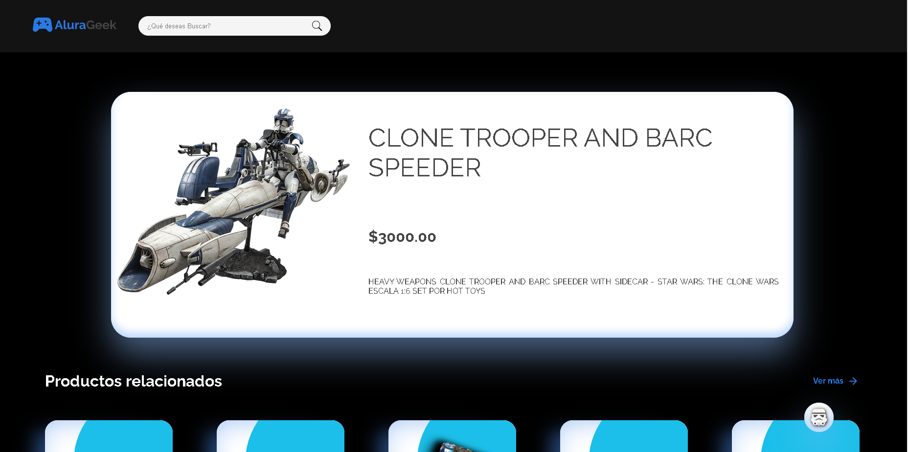
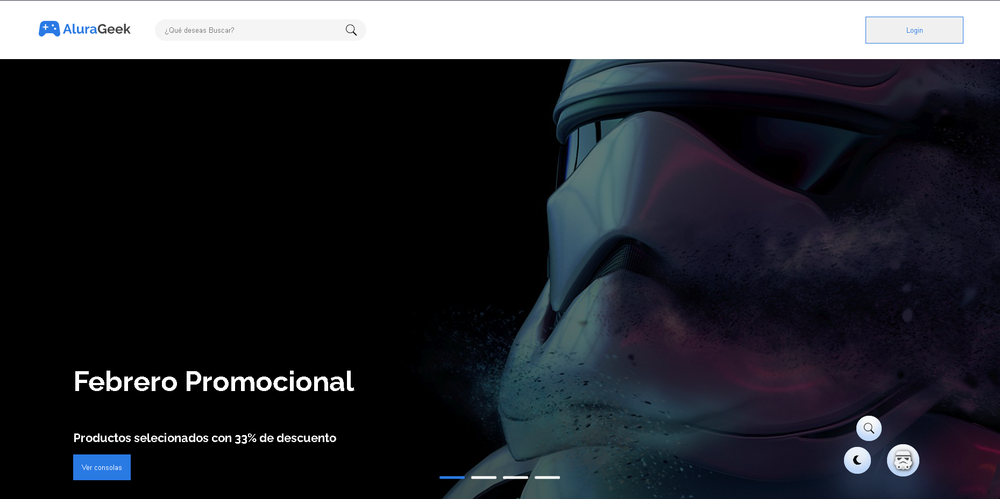
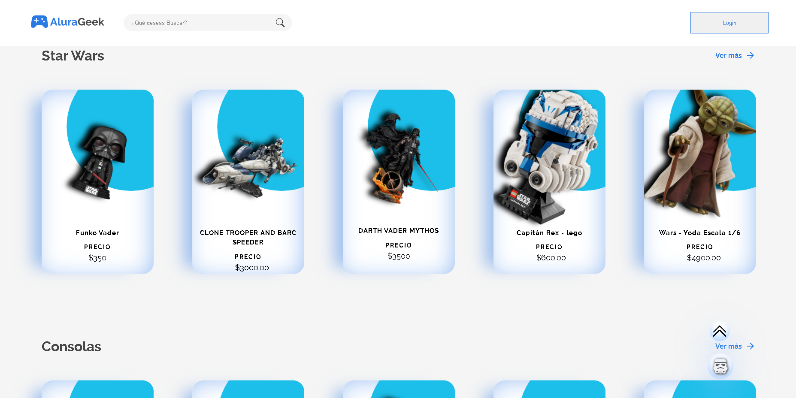
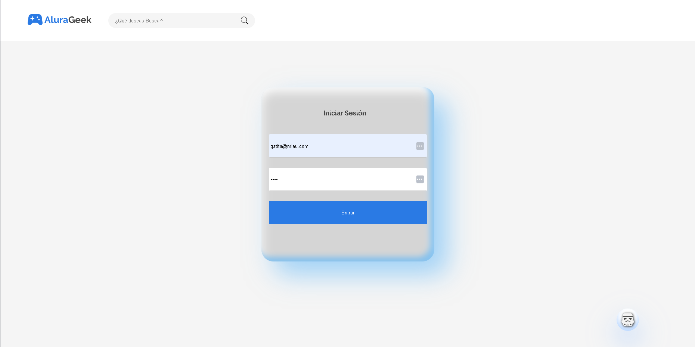
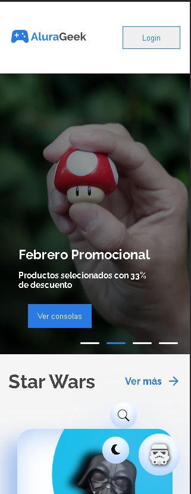
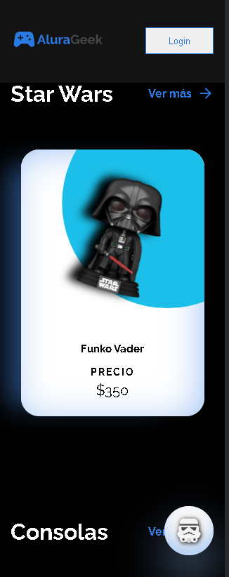

# AluraGeek Frontend Challenge Project

This is my project for the Frontend challenge proposed by Oracle Next Education and Alura LATAM.

## Challenge Description

The challenge involves creating an online store based on the [FIGMA file](https://www.figma.com/file/AB8pEp5K7lo7xUYjQwdfYA/AluraGeek-(Copy)?type=design&node-id=0%3A1&mode=design&t=PGhF0WdsaFdfVfJV-1) provided. While we are expected to follow the design in the FIGMA file, we also have the freedom to customize it to our liking.

One of the key requirements is to implement CRUD (Create, Read, Update, Delete) operations using HTTP requests. This means we should be able to manage and manipulate products within our store, including reading, creating, deleting, and editing them.


## Technologies Used

The project is built using JavaScript and utilizes JSON Server to simulate the API for product management.


## Getting Started

Feel free to clone or modify this project for your own purposes. To get started:

### 1. Clone this repository to your local machine.

   ```bash
   git clone https://github.com/SofiDevO/alura-geek.git
   ```

### 2. Explore the project and make customizations as needed for your own projects.

## Important 🦉

If you want to interact with the API you will need to switch de URL from vercel, to a FAKE API with json-server. 

first you need to install json server:

```bash
npm install -g json-server
```

### 3 - Use the db.json File
You need to use the ```db.json``` ALREADY created, that will act as the data source.  

### 4 - Start the Server

### Start up the JSON 

Server by typing this command into your terminal: ```json-server --watch db.json.``` This will run on "https://localhost:3000" by default. You can change the port it's running on by specifying a different port number when starting the server using the --port flag.

### JSON Server will automatically generate RESTful endpoints based on the data you defined in your JSON file.

If you have a JSON file with an array of "users", this is the endpoint that will be automatically generated by the JSON Server:

- GET  /users - This retrieves a list of all resource entities of users.

- GET /users/:id - This retrieves a specific user by its id.

- POST /users - This creates a new user.

- PUT /users/:id - This updates a user based on a specified id.

- DELETE /users/:id - This deletes a user based on the specified id.

This pattern makes it easy to interact with the mock API in a RESTful manner just like one would do with a real backend API.

4 - Replace the VERCEL fake API, for this new resourse that you create with the ```json-server --watch db.json.``` command. It should look like this:


Now you are able to make petitions to htttp. 


## Contributing

If you'd like to contribute to this project or report issues, please feel free to submit a pull request or open an issue on this repository. We welcome contributions and feedback from the community.

## Acknowledgments

Don't forget to give this repository a star ⭐ if you find it useful!








